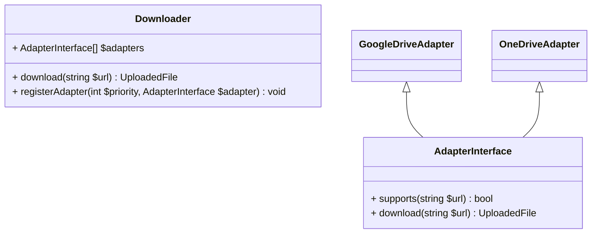

# Explanation document
## Usage
To handle file downloads from Google Drive, OneDrive or plain HTTP/HTTPS URLs, use the `Downloader` class as follows:
```php
$downloader = Downloader::create();

// Download via plain HTTP link
$file = $downloader->download('https://raw.githubusercontent.com/symfony/symfony/refs/heads/7.4/README.md');
// Download from Google Drive (copy the share link on Google Drive and make sure the link is public):
$file = $downloader->download('https://drive.google.com/file/d/1Dj5OdY2CCw0uMLO2WnEGubvNp0evtgwu/view?usp=drive_link');
// Download from OneDrive:
$file = $downloader->download('https://1drv.ms/b/c/8f4d753b56a799fe/ESKrqlN0ImdOrNp7nOV2EBMBzzMso6e1aE_RXldm19QxLg?e=0Xy1zJ');
```
Here, the returned file is an instance of [`Symfony\Component\HttpFoundation\File\UploadedFile`](https://github.com/symfony/symfony/blob/7.4/src/Symfony/Component/HttpFoundation/File/UploadedFile.php).

To implement your own adapter, make a new `AdapterInterface`:
```php
class MyAdapter implements AdapterInterface
{
    public function supports(string $url): bool
    {
        // TODO: Check that the URL is supported by your provider
            
        return true;
    }
    
    public function resolve(string $url): string
    {
        // TODO: Transform the URL into the actual file URL
        
        return $url;
    }
}
```
Then register it with the `Downloader` instance via the constructor method:
```php
$downloader = new \CodingTask\Download\Downloader(
    [
        new GoogleDriveAdapter(),
        new OneDriveAdapter(),
        new DirectHttpAdapter(),
        new MyAdapter(),
    ]
);
```

## Task list
 - [X] Plan out the architecture
 - [X] Map out the flow (what happens when?)
 - [X] Implement stream package
 - [X] Implement base architecture
 - [X] Figure out what MIME package is for
 - [X] Implement plain HTTP/HTTPS adapter
 - [X] Implement Google Drive adapter
 - [X] Add documentation
 - [X] Implement OneDrive adapter
 - [ ] Require `symfony/mime` in `packages/mime`
 - [ ] Add some functional tests?
 - [ ] Extract temporary file path handling into a separate class
 - [ ] Handle third-party services' liveness (https://status.dropbox.com/, https://www.google.com/appsstatus/dashboard/)
 - [ ] Implement better temporary file handling (now those are stored indefinitely long)
 - [ ] Handle file size limits
 - [ ] Add DI to MimeGuesser
 - [X] ~~Extract a wrapper for returning Symfony's `UploadedFile` instances somehow?~~
 - [X] Instantiate `Downloader` with a prefilled array of known adapters
 - [X] ~~Split the library into separate packages per client (e.g. separate package for Google Drive, separate one for OneDrive)~~
 - [X] ~~Support for asynchronous interactions (React-PHP event loop, for example).~~

## Architecture Overview

I would approach the task so that usage is as simple as possible. Preferably, the library should accept just
the URL of the file that needs to be downloaded and decide whether the download can be handled, and which specific
handler should be invoked.

It makes sense to implement the downloader as a registry that accepts specific adapter implementations, each having a
method for checking whether a given URL matches the implementation, and a method that actually handles the download.

Returning the resulting file as an `UploadedFile` instance feels a bit Symfony-specific, as well as requiring 
Symfony-specific contracts. This limits the flexibility a bit, since the end user would be forced into Symfony ecosystem;
what if those dependencies are unwanted? 

Here's the first attempt at planning out the architecture:


### Overall flow
* `Downloader` is instantiated with adapters passed in via the constructor
* Or, the `Downloader` is created with a default set of adapters via the `create()` static method
* A URL is passed to the `Downloader`'s `download()` method
* `Downloader` scans through the available adapters
  * throwing an `UnsupportedUrlException` when there's no adapter found 
  * or calling the matched implementation of an `AdapterInterface`
* `Downloader` calls `AdapterInterface::resolve()` with the specified URL
* The adapter discovers the actual URL of the file
* `Downloader` uses an HTTP client to handle the download and save it to a temporary file
  * Since we want to stay within memory limits, `Downloader` passes the HTTP client's streamed response through the 
    stream package implementation, which writes the response into a temporary file in chunks
  * We also probably want to track disk usage and disallow downloading large files
* We somehow persist the original filename
* We also somehow persist the MIME type
  * If the MIME type is not provided by the server, we can guess it using `symfony/mime`
* `Downloader::download()` returns an instance of `UploadedFile` with the path, the original filename and the MIME type

### Packages
#### Stream package
First guess: `resource` is not a type in PHP, whereas most of the stream interactions are acting on streams. Could this
be a way to harden types?

Idea: the Stream package is supposed to make sure we can write a response stream of the file being downloaded into the
local filesystem.

#### MIME package
Symfony's `UploadedFile` class requires a MIME type to instantiate. If we're downloading something, we need to figure 
out the MIME type that needs to be passed in.

### Why did you choose this structure?

A registry accepting download handler implementations is the simplest approach to allow for extensibility in the future.
The end user is free to provide his own implementation for any third-party service.

### What design patterns did you use and why?

The main pattern used here is the registry pattern used in `Downloader`.

Dependencies of `Downloader` can be injected via the constructor, so that the end user can provide his own 
implementations.

### How does your solution support future extensibility?

Having the `AdapterInterface` allows any third-party developer to simply pass a new adapter for a different service via
the `Downloader`'s constructor method.

## Implementation Details
### How do you handle different URL formats?

The approach I see straight away before writing any code is probably to delegate the URL matching to specific download
adapter implementations; conflicts might be possible though, so it might make sense to allow the end user pass a list of
adapters to be used in the exact case. E.g. if there are several implementations for Google Drive, we should allow for
only one to be actually used to exclude conflicts.

Important note: probably, the simple HTTP adapter should be the fallback option, since HTTP downloads might target any
non-specific domain. Thus, adapters have to be prioritized by their specificity. If none of the vendor-specific
adapters have matched the URL, we try the basic adapter as our last chance.

### What's your approach to error handling?

I would probably have a namespaced set of specific exceptions which would be described in the documentation and in
docblocks.

## Future Considerations
### How would you add support for Dropbox?

Should be as simple as implementing another adapter class, as long as there are no other limitations or specifics in
Dropbox's download implementation.

### How would you handle authentication for private files?

Before any code is written and I don't have any details, I can think of a general approach. I would assume that the
file storages have some way to pass an authentication header somehow along with the download request; the header itself
would carry a secret of some kind. On a library level, it makes sense for the specific adapter classes to allow passing
that as a configuration parameter either upon instantiation or after that.

## Sidenotes

* Symfony's `UploadedFile` class docblock clearly suggests that the class is intended for "files uploaded through a 
  form". Feels like maybe we're misusing it?
* Not quite clear what do I need `functions.php` for.
* We don't want to waste memory on large files. Makes sense to handle those in chunks; streaming a response into a 
  temporary file makes a lot of sense.
* An adapter supporting basic HTTP downloads will always match all URLs starting with `http(s)`. Thus, we need to add a
  provider priority mechanism, so that a basic HTTP adapter becomes a catch-all (except probably other protocols with 
  their specific schemas such as FTP/SFTP/WebDav/...)
* We also probably need to make sure redirects are handled properly
* Do we want `php-http`'s client discovery mechanism?