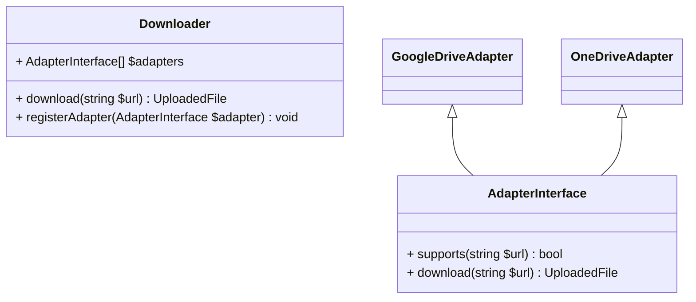

# Explanation document
## Task list
 - [X] Plan out the architecture
 - [ ] Implement stream package
 - [ ] Implement base architecture
 - [ ] Figure out what MIME package is for
 - [ ] Implement plain HTTP/HTTPS adapter
 - [ ] Implement Google Drive adapter
 - [ ] Implement OneDrive adapter
 - [ ] Add some functional tests?
 - [ ] Extract a wrapper for returning Symfony's `UploadedFile` instances somehow?
 - [ ] Instantiate `Downloader` with a prefilled array of known adapters
 - [ ] Split the library into separate packages per client (e.g. separate package for Google Drive, separate one for OneDrive)
 - [ ] Support for asynchronous interactions (React-PHP event loop, for example).
 - [ ] Consider moving the `ClientInterface` argument from `AdapterInterface#download`

## Architecture Overview

I would approach the task so that usage is as simple as possible. Preferably, the library should accept just
the URL of the file that needs to be downloaded and decide whether the download can be handled, and which specific
handler should be invoked.

It makes sense to implement the downloader as a registry that accepts specific adapter implementations, each having a
method for checking whether a given URL matches the implementation, and a method that actually handles the download.

Returning the resulting file as an `UploadedFile` instance feels a bit Symfony-specific, as well as requiring 
Symfony-specific contracts. This limits the flexibility a bit, since the end user would be forced into Symfony ecosystem;
what if those dependencies are unwanted? 

Here's the first attempt at planning out the architecture:

### Packages
#### Stream package
First guess: `resource` is not a type in PHP, whereas most of the stream interactions are acting on streams. Could this
be a way to harden types?

Idea: the Stream package is supposed to make sure we can write a response stream of the file being downloaded into the
local filesystem.

#### MIME package
Symfony's `UploadedFile` class requires a MIME type to instantiate. If we're downloading something, we need to figure 
out the MIME type that needs to be passed in.

## Sidenotes

* Symfony's `UploadedFile` class docblock clearly suggests that the class is intended for "files uploaded through a 
  form". Feels like maybe we're misusing it?
* Not quite clear what do I need `functions.php` for.
* We don't want to waste memory on large files. Makes sense to handle those in chunks; streaming a response into a 
  temporary file makes a lot of sense.